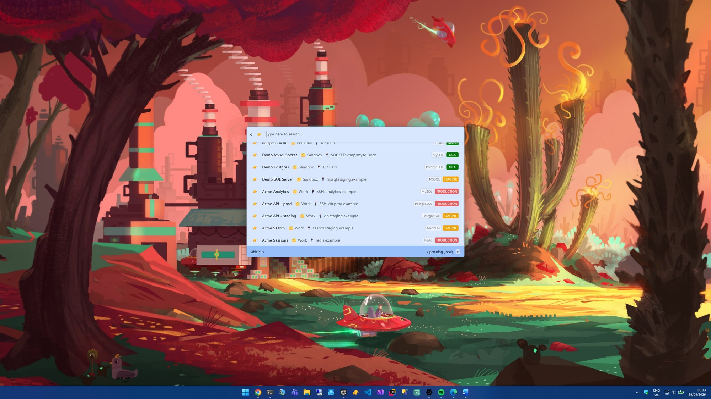

# TablePlus Command Palette

A PowerToys Command Palette extension that surfaces your TablePlus database
connections so you can launch them directly from CmdPal.



## Features

- Browse all TablePlus connections grouped by **connection group**
- Visual environment tags (Local / Staging / Production)
- Driver tag (PostgreSQL, MySQL, SQLite, …)
- Open a connection directly in TablePlus by selecting it
- Reads connections from the local TablePlus data files — no extra config

## How it works

The extension reads `Connections.plist` and `ConnectionGroups.plist` from
TablePlus' local data directory and renders each connection as a Command
Palette item that launches `tableplus://?id=<connection-id>` when invoked.

## Requirements

- **Windows 10 2004+** or **Windows 11**
- **TablePlus** installed
- Microsoft PowerToys with **Command Palette** support

## Installation

### Microsoft Store

[](https://apps.microsoft.com/detail/9P4L93228V63)

Open the listing: <https://apps.microsoft.com/detail/9P4L93228V63>

### WinGet (Microsoft Store source)

```powershell
winget install --source msstore 9P4L93228V63
```

### Build from source

See [docs/development.md](docs/development.md).

## Usage

After installation, open **PowerToys Command Palette** and look for the
**TablePlus** provider. Type to search across your connections, then press
<kbd>Enter</kbd> to open the selected connection in TablePlus.

## Development

See [docs/development.md](docs/development.md) for local build, signing,
install/uninstall, and demo-mode instructions.

## Releasing

See [docs/releasing.md](docs/releasing.md) for the GitHub Actions release
workflow and required signing secrets.

## Project structure

```text
TablePlusCommandPalette/
├─ Commands/      # Command Palette invokable commands
├─ Models/        # TablePlus connection / group models
├─ Pages/         # Command Palette list pages
├─ Services/      # plist parsing and connection lookup
├─ Assets/        # App and extension icons
└─ build-msix.ps1 # Signed MSIX build script (used by release.yml)
```

## Troubleshooting

### The extension shows "No TablePlus connections found"

- Make sure TablePlus is installed and you have at least one saved connection.
- The extension reads from
  `%LocalAppData%\com.tinyapp.TablePlus\data\Connections.plist`. If TablePlus
  stores its data elsewhere on your machine, this extension will not find it.

### Selecting a connection does nothing

The extension launches `tableplus://?id=<id>`. Confirm the URI handler works:

```powershell
start "tableplus://?id=<some-id>"
```

If TablePlus does not open, reinstall TablePlus so the URI handler is
registered.

## License

This project is licensed under the [MIT License](LICENSE).

## Disclaimer

This project is an independent extension for Microsoft PowerToys and is
not affiliated with or endorsed by TablePlus or Microsoft.
